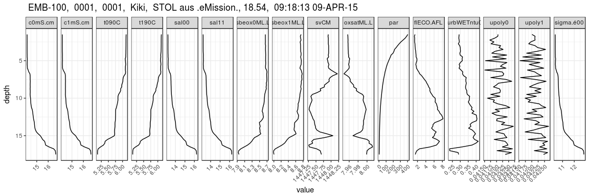
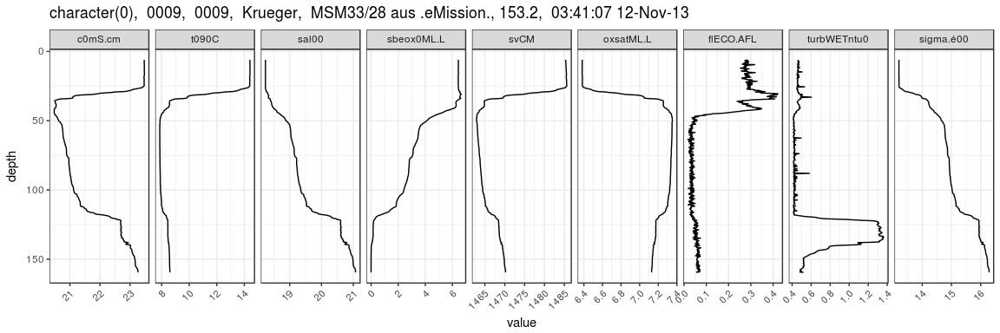

read SBE CTD cnv-files into data.frame
================
Marko Lipka, David Kaiser
12/2/2017

*read.cnv.file()* function takes a filename of a .cnv file as argument and returns a data.frame.

Example
=======

``` r
Ex1 <- read.cnv.file("example data/V0001F01.cnv")
Ex2 <- read.cnv.file("example data/P0009F01.cnv")

pander(head(Ex1$data))
```

<table>
<caption>Table continues below</caption>
<colgroup>
<col width="10%" />
<col width="10%" />
<col width="12%" />
<col width="12%" />
<col width="10%" />
<col width="10%" />
<col width="10%" />
<col width="10%" />
<col width="15%" />
</colgroup>
<thead>
<tr class="header">
<th align="center">depSM</th>
<th align="center">prDM</th>
<th align="center">c0mS.cm</th>
<th align="center">c1mS.cm</th>
<th align="center">t090C</th>
<th align="center">t190C</th>
<th align="center">sal00</th>
<th align="center">sal11</th>
<th align="center">sbeox0ML.L</th>
</tr>
</thead>
<tbody>
<tr class="odd">
<td align="center">1.5</td>
<td align="center">1.36</td>
<td align="center">14.16</td>
<td align="center">14.16</td>
<td align="center">6.127</td>
<td align="center">6.125</td>
<td align="center">13.21</td>
<td align="center">13.21</td>
<td align="center">8.654</td>
</tr>
<tr class="even">
<td align="center">1.75</td>
<td align="center">1.613</td>
<td align="center">14.16</td>
<td align="center">14.16</td>
<td align="center">6.125</td>
<td align="center">6.122</td>
<td align="center">13.21</td>
<td align="center">13.21</td>
<td align="center">8.655</td>
</tr>
<tr class="odd">
<td align="center">2</td>
<td align="center">1.865</td>
<td align="center">14.16</td>
<td align="center">14.16</td>
<td align="center">6.124</td>
<td align="center">6.121</td>
<td align="center">13.21</td>
<td align="center">13.21</td>
<td align="center">8.654</td>
</tr>
<tr class="even">
<td align="center">2.25</td>
<td align="center">2.117</td>
<td align="center">14.16</td>
<td align="center">14.16</td>
<td align="center">6.123</td>
<td align="center">6.121</td>
<td align="center">13.21</td>
<td align="center">13.21</td>
<td align="center">8.655</td>
</tr>
<tr class="odd">
<td align="center">2.5</td>
<td align="center">2.37</td>
<td align="center">14.17</td>
<td align="center">14.16</td>
<td align="center">6.123</td>
<td align="center">6.121</td>
<td align="center">13.21</td>
<td align="center">13.21</td>
<td align="center">8.656</td>
</tr>
<tr class="even">
<td align="center">2.75</td>
<td align="center">2.621</td>
<td align="center">14.16</td>
<td align="center">14.16</td>
<td align="center">6.122</td>
<td align="center">6.121</td>
<td align="center">13.21</td>
<td align="center">13.21</td>
<td align="center">8.652</td>
</tr>
</tbody>
</table>

<table>
<caption>Table continues below</caption>
<colgroup>
<col width="16%" />
<col width="8%" />
<col width="15%" />
<col width="10%" />
<col width="10%" />
<col width="8%" />
<col width="15%" />
<col width="16%" />
</colgroup>
<thead>
<tr class="header">
<th align="center">sbeox1ML.L</th>
<th align="center">svCM</th>
<th align="center">oxsatML.L</th>
<th align="center">altM</th>
<th align="center">par</th>
<th align="center">spar</th>
<th align="center">flECO.AFL</th>
<th align="center">turbWETntu0</th>
</tr>
</thead>
<tbody>
<tr class="odd">
<td align="center">8.746</td>
<td align="center">1448</td>
<td align="center">7.957</td>
<td align="center">17.55</td>
<td align="center">402.9</td>
<td align="center">1012</td>
<td align="center">1.401</td>
<td align="center">0.2925</td>
</tr>
<tr class="even">
<td align="center">8.727</td>
<td align="center">1448</td>
<td align="center">7.957</td>
<td align="center">16.84</td>
<td align="center">386.3</td>
<td align="center">1242</td>
<td align="center">1.254</td>
<td align="center">0.2913</td>
</tr>
<tr class="odd">
<td align="center">8.735</td>
<td align="center">1448</td>
<td align="center">7.957</td>
<td align="center">16.98</td>
<td align="center">365.8</td>
<td align="center">1248</td>
<td align="center">1.32</td>
<td align="center">0.2906</td>
</tr>
<tr class="even">
<td align="center">8.746</td>
<td align="center">1448</td>
<td align="center">7.957</td>
<td align="center">16.76</td>
<td align="center">336.8</td>
<td align="center">1247</td>
<td align="center">1.308</td>
<td align="center">0.2924</td>
</tr>
<tr class="odd">
<td align="center">8.723</td>
<td align="center">1448</td>
<td align="center">7.957</td>
<td align="center">16.53</td>
<td align="center">306.9</td>
<td align="center">1250</td>
<td align="center">1.316</td>
<td align="center">0.2939</td>
</tr>
<tr class="even">
<td align="center">8.731</td>
<td align="center">1448</td>
<td align="center">7.957</td>
<td align="center">16.26</td>
<td align="center">282.6</td>
<td align="center">1245</td>
<td align="center">1.392</td>
<td align="center">0.2873</td>
</tr>
</tbody>
</table>

<table style="width:94%;">
<caption>Table continues below</caption>
<colgroup>
<col width="8%" />
<col width="13%" />
<col width="13%" />
<col width="12%" />
<col width="9%" />
<col width="16%" />
<col width="9%" />
<col width="9%" />
</colgroup>
<thead>
<tr class="header">
<th align="center">nbf</th>
<th align="center">upoly0</th>
<th align="center">upoly1</th>
<th align="center">timeS</th>
<th align="center">scan</th>
<th align="center">sigma.é00</th>
<th align="center">flag</th>
<th align="center">nbin</th>
</tr>
</thead>
<tbody>
<tr class="odd">
<td align="center">0</td>
<td align="center">0.04206</td>
<td align="center">0.04201</td>
<td align="center">-3.638</td>
<td align="center">-86</td>
<td align="center">10.37</td>
<td align="center">0</td>
<td align="center">92</td>
</tr>
<tr class="even">
<td align="center">0</td>
<td align="center">0.04205</td>
<td align="center">0.04213</td>
<td align="center">14.12</td>
<td align="center">340</td>
<td align="center">10.37</td>
<td align="center">0</td>
<td align="center">95</td>
</tr>
<tr class="odd">
<td align="center">0</td>
<td align="center">0.04192</td>
<td align="center">0.04212</td>
<td align="center">17.18</td>
<td align="center">413</td>
<td align="center">10.37</td>
<td align="center">0</td>
<td align="center">68</td>
</tr>
<tr class="even">
<td align="center">0</td>
<td align="center">0.04172</td>
<td align="center">0.04213</td>
<td align="center">18.94</td>
<td align="center">456</td>
<td align="center">10.37</td>
<td align="center">0</td>
<td align="center">34</td>
</tr>
<tr class="odd">
<td align="center">0</td>
<td align="center">0.04189</td>
<td align="center">0.04196</td>
<td align="center">20.41</td>
<td align="center">491</td>
<td align="center">10.38</td>
<td align="center">0</td>
<td align="center">31</td>
</tr>
<tr class="even">
<td align="center">0</td>
<td align="center">0.04177</td>
<td align="center">0.04188</td>
<td align="center">21.85</td>
<td align="center">525</td>
<td align="center">10.37</td>
<td align="center">0</td>
<td align="center">41</td>
</tr>
</tbody>
</table>

<table style="width:50%;">
<colgroup>
<col width="25%" />
<col width="25%" />
</colgroup>
<thead>
<tr class="header">
<th align="center">header.latitude</th>
<th align="center">header.longitude</th>
</tr>
</thead>
<tbody>
<tr class="odd">
<td align="center">54.26</td>
<td align="center">11.95</td>
</tr>
<tr class="even">
<td align="center">54.26</td>
<td align="center">11.95</td>
</tr>
<tr class="odd">
<td align="center">54.26</td>
<td align="center">11.95</td>
</tr>
<tr class="even">
<td align="center">54.26</td>
<td align="center">11.95</td>
</tr>
<tr class="odd">
<td align="center">54.26</td>
<td align="center">11.95</td>
</tr>
<tr class="even">
<td align="center">54.26</td>
<td align="center">11.95</td>
</tr>
</tbody>
</table>

``` r
pander(Ex1$meta)
```

-   **cruise**: EMB-100
-   **station**: 0001
-   **cast**: 0001
-   **series**: Kiki
-   **name**: STOL aus .eMission.
-   **bottom.depth**: 18.54
-   **timestamp**: 09:18:13 09-APR-15

<!-- end of list -->
``` r
pander(head(Ex2$data))
```

<table style="width:100%;">
<caption>Table continues below</caption>
<colgroup>
<col width="10%" />
<col width="10%" />
<col width="13%" />
<col width="10%" />
<col width="10%" />
<col width="17%" />
<col width="9%" />
<col width="15%" />
</colgroup>
<thead>
<tr class="header">
<th align="center">depSM</th>
<th align="center">prDM</th>
<th align="center">c0mS.cm</th>
<th align="center">t090C</th>
<th align="center">sal00</th>
<th align="center">sbeox0ML.L</th>
<th align="center">svCM</th>
<th align="center">oxsatML.L</th>
</tr>
</thead>
<tbody>
<tr class="odd">
<td align="center">6</td>
<td align="center">5.945</td>
<td align="center">23.47</td>
<td align="center">14.4</td>
<td align="center">18.24</td>
<td align="center">6.44</td>
<td align="center">1485</td>
<td align="center">6.382</td>
</tr>
<tr class="even">
<td align="center">6.25</td>
<td align="center">6.197</td>
<td align="center">23.47</td>
<td align="center">14.4</td>
<td align="center">18.24</td>
<td align="center">6.441</td>
<td align="center">1485</td>
<td align="center">6.382</td>
</tr>
<tr class="odd">
<td align="center">6.5</td>
<td align="center">6.449</td>
<td align="center">23.47</td>
<td align="center">14.4</td>
<td align="center">18.24</td>
<td align="center">6.441</td>
<td align="center">1485</td>
<td align="center">6.382</td>
</tr>
<tr class="even">
<td align="center">6.75</td>
<td align="center">6.701</td>
<td align="center">23.47</td>
<td align="center">14.41</td>
<td align="center">18.24</td>
<td align="center">6.441</td>
<td align="center">1485</td>
<td align="center">6.382</td>
</tr>
<tr class="odd">
<td align="center">7</td>
<td align="center">6.953</td>
<td align="center">23.47</td>
<td align="center">14.41</td>
<td align="center">18.24</td>
<td align="center">6.442</td>
<td align="center">1485</td>
<td align="center">6.382</td>
</tr>
<tr class="even">
<td align="center">7.25</td>
<td align="center">7.205</td>
<td align="center">23.47</td>
<td align="center">14.41</td>
<td align="center">18.24</td>
<td align="center">6.442</td>
<td align="center">1485</td>
<td align="center">6.382</td>
</tr>
</tbody>
</table>

<table>
<caption>Table continues below</caption>
<colgroup>
<col width="10%" />
<col width="9%" />
<col width="15%" />
<col width="18%" />
<col width="7%" />
<col width="14%" />
<col width="15%" />
<col width="9%" />
</colgroup>
<thead>
<tr class="header">
<th align="center">altM</th>
<th align="center">spar</th>
<th align="center">flECO.AFL</th>
<th align="center">turbWETntu0</th>
<th align="center">nbf</th>
<th align="center">latitude</th>
<th align="center">longitude</th>
<th align="center">timeS</th>
</tr>
</thead>
<tbody>
<tr class="odd">
<td align="center">120.4</td>
<td align="center">0</td>
<td align="center">0.2864</td>
<td align="center">0.4643</td>
<td align="center">0</td>
<td align="center">44.7</td>
<td align="center">31.46</td>
<td align="center">15.95</td>
</tr>
<tr class="even">
<td align="center">123.3</td>
<td align="center">0</td>
<td align="center">0.2824</td>
<td align="center">0.4638</td>
<td align="center">0</td>
<td align="center">44.7</td>
<td align="center">31.46</td>
<td align="center">29.88</td>
</tr>
<tr class="odd">
<td align="center">131.2</td>
<td align="center">0</td>
<td align="center">0.273</td>
<td align="center">0.4627</td>
<td align="center">0</td>
<td align="center">44.7</td>
<td align="center">31.46</td>
<td align="center">30.68</td>
</tr>
<tr class="even">
<td align="center">129.1</td>
<td align="center">0</td>
<td align="center">0.2758</td>
<td align="center">0.4656</td>
<td align="center">0</td>
<td align="center">44.7</td>
<td align="center">31.46</td>
<td align="center">31.52</td>
</tr>
<tr class="odd">
<td align="center">126.9</td>
<td align="center">0</td>
<td align="center">0.2894</td>
<td align="center">0.4619</td>
<td align="center">0</td>
<td align="center">44.7</td>
<td align="center">31.46</td>
<td align="center">32.67</td>
</tr>
<tr class="even">
<td align="center">135.7</td>
<td align="center">0</td>
<td align="center">0.2838</td>
<td align="center">0.4735</td>
<td align="center">0</td>
<td align="center">44.7</td>
<td align="center">31.46</td>
<td align="center">34.23</td>
</tr>
</tbody>
</table>

<table style="width:96%;">
<colgroup>
<col width="9%" />
<col width="16%" />
<col width="9%" />
<col width="9%" />
<col width="25%" />
<col width="25%" />
</colgroup>
<thead>
<tr class="header">
<th align="center">scan</th>
<th align="center">sigma.é00</th>
<th align="center">flag</th>
<th align="center">nbin</th>
<th align="center">header.latitude</th>
<th align="center">header.longitude</th>
</tr>
</thead>
<tbody>
<tr class="odd">
<td align="center">384</td>
<td align="center">13.2</td>
<td align="center">0</td>
<td align="center">710</td>
<td align="center">44.7</td>
<td align="center">31.46</td>
</tr>
<tr class="even">
<td align="center">718</td>
<td align="center">13.2</td>
<td align="center">0</td>
<td align="center">17</td>
<td align="center">44.7</td>
<td align="center">31.46</td>
</tr>
<tr class="odd">
<td align="center">737</td>
<td align="center">13.2</td>
<td align="center">0</td>
<td align="center">19</td>
<td align="center">44.7</td>
<td align="center">31.46</td>
</tr>
<tr class="even">
<td align="center">757</td>
<td align="center">13.2</td>
<td align="center">0</td>
<td align="center">23</td>
<td align="center">44.7</td>
<td align="center">31.46</td>
</tr>
<tr class="odd">
<td align="center">785</td>
<td align="center">13.2</td>
<td align="center">0</td>
<td align="center">34</td>
<td align="center">44.7</td>
<td align="center">31.46</td>
</tr>
<tr class="even">
<td align="center">823</td>
<td align="center">13.2</td>
<td align="center">0</td>
<td align="center">36</td>
<td align="center">44.7</td>
<td align="center">31.46</td>
</tr>
</tbody>
</table>

``` r
pander(Ex2$meta)
```

-   **cruise**:
-   **station**: 0009
-   **cast**: 0009
-   **series**: Krueger
-   **name**: MSM33/28 aus .eMission.
-   **bottom.depth**: 153.2
-   **timestamp**: 03:41:07 12-Nov-13

<!-- end of list -->
Plots
-----

``` r
plot.CTD.data(Ex1)
```



``` r
plot.CTD.data(Ex2)
```


