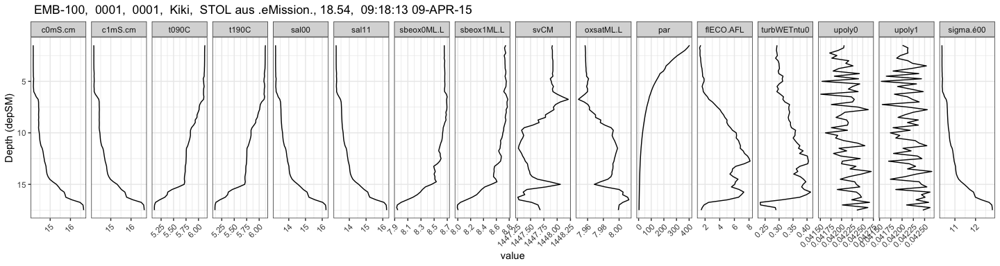
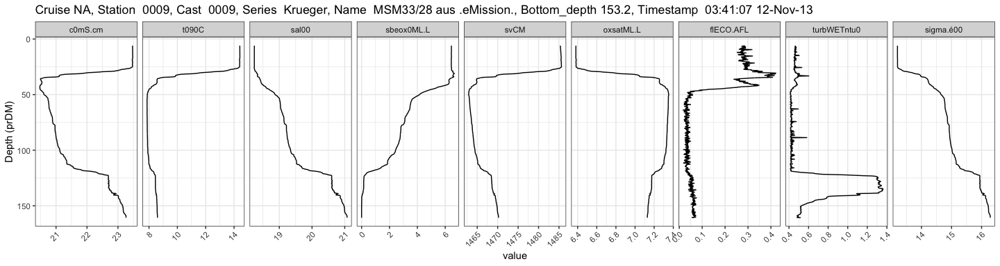
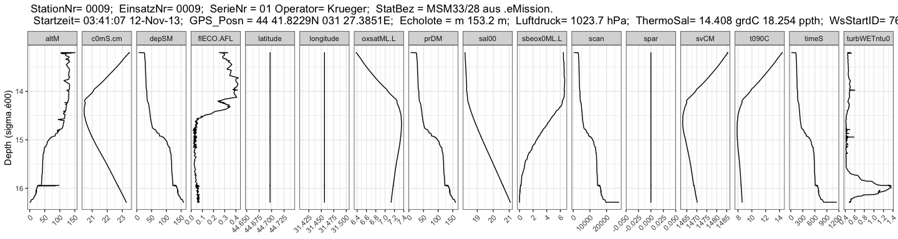
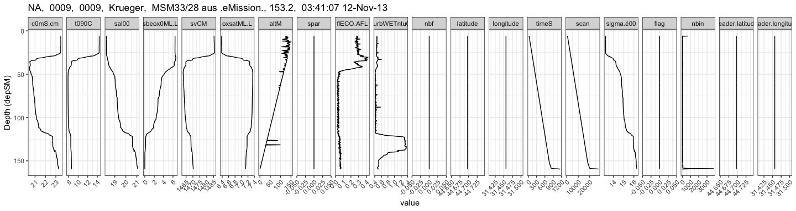

read and plot SBE CTD cnv-files
================
Marko Lipka, David Kaiser
2021-03-20

`read.cnv.file()` function takes a filename of a .cnv file as argument
and returns a data.frame.

`plot.CTD.data()` function

-   takes the output of `read.cnv.file()` and returns a facetted ggplot.
-   optional arguments:
    -   depvar: character (vector) of parameter(s) that should be used
        as depth axis. First match in parameter names will be used if
        multiple parameters are defined.
    -   not2plot: character (vector) of parameter(s) that should not be
        plotted. default is a list of common metadata parameters like
        “*scan*”, “*nbin*”, “*flag*”, “*latitude*”, …

# Examples

## V0001F01.cnv

``` r
Ex1 <- read.cnv.file("example data/V0001F01.cnv")

knitr::kable(head(Ex1$data))
```

| depSM |    prDM |  c0mS.cm |  c1mS.cm |  t090C |  t190C |   sal00 |   sal11 | sbeox0ML.L | sbeox1ML.L |    svCM | oxsatML.L |     altM |    par |   spar | flECO.AFL | turbWETntu0 | nbf |  upoly0 |  upoly1 |  timeS | scan | sigma.é00 | flag | nbin | header.latitude | header.longitude |
|------:|--------:|---------:|---------:|-------:|-------:|--------:|--------:|-----------:|-----------:|--------:|----------:|---------:|-------:|-------:|----------:|------------:|----:|--------:|--------:|-------:|-----:|----------:|-----:|-----:|----------------:|-----------------:|
|  1.50 | 1.36001 | 14.16115 | 14.16036 | 6.1272 | 6.1251 | 13.2087 | 13.2088 |    8.65394 |    8.74601 | 1447.91 |   7.95670 | 17.55465 | 402.87 | 1012.2 |    1.4015 |     0.29254 |   0 | 0.04206 | 0.04201 | -3.638 |  -86 |   10.3704 |    0 |   92 |        54.25613 |         11.94581 |
|  1.75 | 1.61264 | 14.16280 | 14.16364 | 6.1245 | 6.1219 | 13.2115 | 13.2133 |    8.65493 |    8.72731 | 1447.90 |   7.95708 | 16.83636 | 386.34 | 1241.7 |    1.2540 |     0.29134 |   0 | 0.04205 | 0.04213 | 14.117 |  340 |   10.3727 |    0 |   95 |        54.25613 |         11.94581 |
|  2.00 | 1.86478 | 14.16379 | 14.16305 | 6.1236 | 6.1211 | 13.2128 | 13.2130 |    8.65435 |    8.73503 | 1447.91 |   7.95719 | 16.97811 | 365.78 | 1247.6 |    1.3204 |     0.29062 |   0 | 0.04192 | 0.04212 | 17.178 |  413 |   10.3738 |    0 |   68 |        54.25613 |         11.94581 |
|  2.25 | 2.11683 | 14.16334 | 14.16383 | 6.1227 | 6.1207 | 13.2126 | 13.2138 |    8.65487 |    8.74630 | 1447.91 |   7.95737 | 16.75866 | 336.83 | 1246.8 |    1.3079 |     0.29237 |   0 | 0.04172 | 0.04213 | 18.940 |  456 |   10.3737 |    0 |   34 |        54.25613 |         11.94581 |
|  2.50 | 2.36962 | 14.16532 | 14.16366 | 6.1229 | 6.1206 | 13.2145 | 13.2137 |    8.65615 |    8.72256 | 1447.91 |   7.95724 | 16.53253 | 306.92 | 1250.1 |    1.3161 |     0.29388 |   0 | 0.04189 | 0.04196 | 20.410 |  491 |   10.3752 |    0 |   31 |        54.25613 |         11.94581 |
|  2.75 | 2.62119 | 14.16302 | 14.16275 | 6.1224 | 6.1208 | 13.2122 | 13.2126 |    8.65235 |    8.73113 | 1447.91 |   7.95746 | 16.25545 | 282.55 | 1245.4 |    1.3918 |     0.28734 |   0 | 0.04177 | 0.04188 | 21.853 |  525 |   10.3735 |    0 |   41 |        54.25613 |         11.94581 |

``` r
pander(Ex1$meta)
```

-   **cruise**: EMB-100
-   **station**: 0001
-   **cast**: 0001
-   **series**: Kiki
-   **name**: STOL aus .eMission.
-   **bottom.depth**: 18.54
-   **timestamp**: 09:18:13 09-APR-15

<!-- end of list -->

``` r
plot.CTD.data(Ex1)
```

<!-- -->

## P0009F01.cnv

``` r
Ex2 <- read.cnv.file("example data/P0009F01.cnv")

knitr::kable(head(Ex2$data))
```

| depSM |    prDM |  c0mS.cm |   t090C |   sal00 | sbeox0ML.L |    svCM | oxsatML.L |     altM | spar | flECO.AFL | turbWETntu0 | nbf | latitude | longitude |  timeS | scan | sigma.é00 | flag | nbin | header.latitude | header.longitude |
|------:|--------:|---------:|--------:|--------:|-----------:|--------:|----------:|---------:|-----:|----------:|------------:|----:|---------:|----------:|-------:|-----:|----------:|-----:|-----:|----------------:|-----------------:|
|  6.00 | 5.94454 | 23.47002 | 14.4042 | 18.2368 |    6.44049 | 1485.34 |   6.38187 | 120.4128 |    0 |   0.28637 |     0.46429 |   0 |   44.697 |   31.4564 | 15.945 |  384 |   13.2020 |    0 |  710 |        44.69705 |         31.45642 |
|  6.25 | 6.19658 | 23.47004 | 14.4042 | 18.2368 |    6.44113 | 1485.34 |   6.38188 | 123.2926 |    0 |   0.28241 |     0.46385 |   0 |   44.697 |   31.4564 | 29.884 |  718 |   13.2019 |    0 |   17 |        44.69705 |         31.45642 |
|  6.50 | 6.44872 | 23.47012 | 14.4042 | 18.2368 |    6.44125 | 1485.35 |   6.38188 | 131.2332 |    0 |   0.27295 |     0.46274 |   0 |   44.697 |   31.4564 | 30.678 |  737 |   13.2020 |    0 |   19 |        44.69705 |         31.45642 |
|  6.75 | 6.70098 | 23.47121 | 14.4062 | 18.2367 |    6.44137 | 1485.36 |   6.38161 | 129.1096 |    0 |   0.27584 |     0.46556 |   0 |   44.697 |   31.4564 | 31.517 |  757 |   13.2016 |    0 |   23 |        44.69705 |         31.45642 |
|  7.00 | 6.95274 | 23.47125 | 14.4059 | 18.2369 |    6.44155 | 1485.36 |   6.38165 | 126.9133 |    0 |   0.28945 |     0.46188 |   0 |   44.697 |   31.4564 | 32.671 |  785 |   13.2017 |    0 |   34 |        44.69705 |         31.45642 |
|  7.25 | 7.20464 | 23.47110 | 14.4056 | 18.2368 |    6.44189 | 1485.36 |   6.38171 | 135.6922 |    0 |   0.28379 |     0.47353 |   0 |   44.697 |   31.4564 | 34.233 |  823 |   13.2018 |    0 |   36 |        44.69705 |         31.45642 |

``` r
pander(Ex2$meta)
```

-   **cruise**:
-   **station**: 0009
-   **cast**: 0009
-   **series**: Krueger
-   **name**: MSM33/28 aus .eMission.
-   **bottom.depth**: 153.2
-   **timestamp**: 03:41:07 12-Nov-13

<!-- end of list -->

``` r
plot.CTD.data(Ex2)
```

<!-- -->

``` r
plot.CTD.data(Ex2, depvar = "prDM")
```

<!-- -->

``` r
plot.CTD.data(Ex2, depvar = "sigma.é00", not2plot = c("flag", "nbin", "nbf", "upoly0", "upoly1"))
```

<!-- -->

``` r
plot.CTD.data(Ex2, not2plot = "par")
```

<!-- -->
