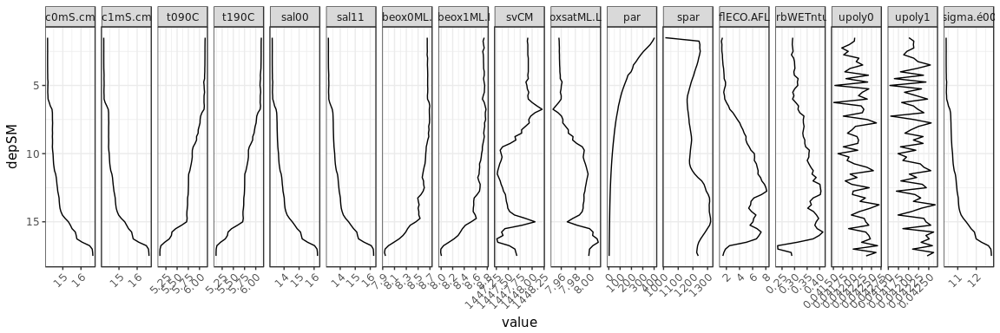

readCNV example
================
Marko Lipka
12/2/2017

read cnv file:
--------------

``` r
df <- read.cnv.file("example data/V0001F01.cnv")

head(df)
```

    ##   depSM    prDM  c0mS.cm  c1mS.cm  t090C  t190C   sal00   sal11 sbeox0ML.L
    ## 1  1.50 1.36001 14.16115 14.16036 6.1272 6.1251 13.2087 13.2088    8.65394
    ## 2  1.75 1.61264 14.16280 14.16364 6.1245 6.1219 13.2115 13.2133    8.65493
    ## 3  2.00 1.86478 14.16379 14.16305 6.1236 6.1211 13.2128 13.2130    8.65435
    ## 4  2.25 2.11683 14.16334 14.16383 6.1227 6.1207 13.2126 13.2138    8.65487
    ## 5  2.50 2.36962 14.16532 14.16366 6.1229 6.1206 13.2145 13.2137    8.65615
    ## 6  2.75 2.62119 14.16302 14.16275 6.1224 6.1208 13.2122 13.2126    8.65235
    ##   sbeox1ML.L    svCM oxsatML.L     altM    par   spar flECO.AFL
    ## 1    8.74601 1447.91   7.95670 17.55465 402.87 1012.2    1.4015
    ## 2    8.72731 1447.90   7.95708 16.83636 386.34 1241.7    1.2540
    ## 3    8.73503 1447.91   7.95719 16.97811 365.78 1247.6    1.3204
    ## 4    8.74630 1447.91   7.95737 16.75866 336.83 1246.8    1.3079
    ## 5    8.72256 1447.91   7.95724 16.53253 306.92 1250.1    1.3161
    ## 6    8.73113 1447.91   7.95746 16.25545 282.55 1245.4    1.3918
    ##   turbWETntu0 nbf  upoly0  upoly1  timeS scan sigma.é00 flag nbin
    ## 1     0.29254   0 0.04206 0.04201 -3.638  -86   10.3704    0   92
    ## 2     0.29134   0 0.04205 0.04213 14.117  340   10.3727    0   95
    ## 3     0.29062   0 0.04192 0.04212 17.178  413   10.3738    0   68
    ## 4     0.29237   0 0.04172 0.04213 18.940  456   10.3737    0   34
    ## 5     0.29388   0 0.04189 0.04196 20.410  491   10.3752    0   31
    ## 6     0.28734   0 0.04177 0.04188 21.853  525   10.3735    0   41
    ##   header.latitude header.longitude
    ## 1        54.25613         11.94581
    ## 2        54.25613         11.94581
    ## 3        54.25613         11.94581
    ## 4        54.25613         11.94581
    ## 5        54.25613         11.94581
    ## 6        54.25613         11.94581

Plot
----


