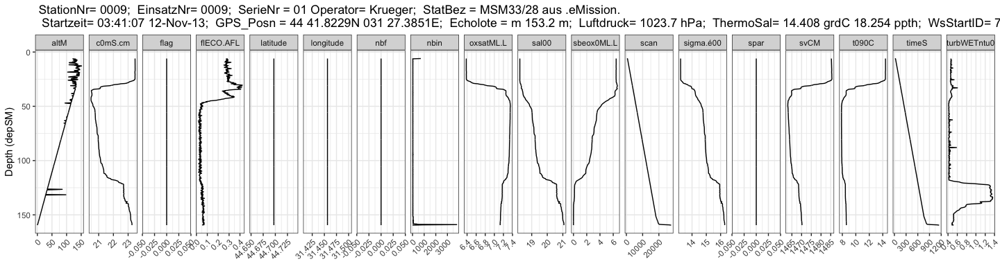

read and plot SBE CTD cnv-files
================
Marko Lipka, David Kaiser
2021-05-05

`read.cnv.file()` function takes a filename of a .cnv file as argument
and returns a data.frame.

`plot.CTD.data()` function

-   takes the output of `read.cnv.file()` and returns a facetted ggplot.
-   optional arguments:
    -   depvar: character (vector) of parameter(s) that should be used
        as depth axis. First match in parameter names will be used if
        multiple parameters are defined.
    -   not2plot: character (vector) of parameter(s) that should not be
        plotted. default is a list of common metadata parameters like
        “*scan*”, “*nbin*”, “*flag*”, “*latitude*”, …

`extract.stats()` function takes a filename of a .cnv file or the output
of `read.cnv.file()` as argument and returns summary statistics of each
parameter.

`extract.stats.dir()` function takes a directory as argument and returns
summary statistics of each parameter in each .cnv file in the given
directory.

`map.CTD.data()` function

-   takes a directory as argument
-   finds and `read.cnv.file()` all cnv files in this directory
-   creates a dynamic point map which popups the `plot.CTD.data()`-plot
    on click

# Examples

## V0001F01.cnv

``` r
Ex1 <- read.cnv.file("example data/IOW/V0001F01.cnv")

knitr::kable(head(Ex1$data))
```

| depSM |    prDM |  c0mS.cm |  c1mS.cm |  t090C |  t190C |   sal00 |   sal11 | sbeox0ML.L | sbeox1ML.L |    svCM | oxsatML.L |     altM |    par |   spar | flECO.AFL | turbWETntu0 | nbf |  upoly0 |  upoly1 |  timeS | scan | sigma.é00 | flag | nbin |
|------:|--------:|---------:|---------:|-------:|-------:|--------:|--------:|-----------:|-----------:|--------:|----------:|---------:|-------:|-------:|----------:|------------:|----:|--------:|--------:|-------:|-----:|----------:|-----:|-----:|
|  1.50 | 1.36001 | 14.16115 | 14.16036 | 6.1272 | 6.1251 | 13.2087 | 13.2088 |    8.65394 |    8.74601 | 1447.91 |   7.95670 | 17.55465 | 402.87 | 1012.2 |    1.4015 |     0.29254 |   0 | 0.04206 | 0.04201 | -3.638 |  -86 |   10.3704 |    0 |   92 |
|  1.75 | 1.61264 | 14.16280 | 14.16364 | 6.1245 | 6.1219 | 13.2115 | 13.2133 |    8.65493 |    8.72731 | 1447.90 |   7.95708 | 16.83636 | 386.34 | 1241.7 |    1.2540 |     0.29134 |   0 | 0.04205 | 0.04213 | 14.117 |  340 |   10.3727 |    0 |   95 |
|  2.00 | 1.86478 | 14.16379 | 14.16305 | 6.1236 | 6.1211 | 13.2128 | 13.2130 |    8.65435 |    8.73503 | 1447.91 |   7.95719 | 16.97811 | 365.78 | 1247.6 |    1.3204 |     0.29062 |   0 | 0.04192 | 0.04212 | 17.178 |  413 |   10.3738 |    0 |   68 |
|  2.25 | 2.11683 | 14.16334 | 14.16383 | 6.1227 | 6.1207 | 13.2126 | 13.2138 |    8.65487 |    8.74630 | 1447.91 |   7.95737 | 16.75866 | 336.83 | 1246.8 |    1.3079 |     0.29237 |   0 | 0.04172 | 0.04213 | 18.940 |  456 |   10.3737 |    0 |   34 |
|  2.50 | 2.36962 | 14.16532 | 14.16366 | 6.1229 | 6.1206 | 13.2145 | 13.2137 |    8.65615 |    8.72256 | 1447.91 |   7.95724 | 16.53253 | 306.92 | 1250.1 |    1.3161 |     0.29388 |   0 | 0.04189 | 0.04196 | 20.410 |  491 |   10.3752 |    0 |   31 |
|  2.75 | 2.62119 | 14.16302 | 14.16275 | 6.1224 | 6.1208 | 13.2122 | 13.2126 |    8.65235 |    8.73113 | 1447.91 |   7.95746 | 16.25545 | 282.55 | 1245.4 |    1.3918 |     0.28734 |   0 | 0.04177 | 0.04188 | 21.853 |  525 |   10.3735 |    0 |   41 |

``` r
pander(Ex1$meta)
```

*ReiseNr = EMB-100*, *StationNr= 0001*, *EinsatzNr= 0001*, *SerieNr = 01
Operator= Kiki*, *StatBez = STOL aus .eMission.*, *Startzeit= 09:18:13
09-APR-15*, *GPS\_Posn = 54 15.3678N 11 56.7485E*, *Echolote = 18.54 m*,
*Luftdruck= 1028.6 hPa*, *ThermoSal= 6.274 grdC 13.02 ppth* and
*WsStartID= 1*

``` r
pander(Ex1$coords)
```

-   **Lat**: 54 15.3678N
-   **Lon**: 11 56.7485E

<!-- end of list -->

``` r
plot.CTD.data(Ex1)
```

<!-- -->

``` r
knitr::kable(extract.stats(Ex1))
```

| parameter   |       Min. |    1st Qu. |     Median |         Mean |    3rd Qu. |       Max. |
|:------------|-----------:|-----------:|-----------:|-------------:|-----------:|-----------:|
| depSM       |    1.50000 |    5.50000 |    9.50000 | 9.500000e+00 |   13.50000 |   17.50000 |
| prDM        |    1.36001 |    5.39597 |    9.43236 | 9.432500e+00 |   13.46876 |   17.50504 |
| c0mS.cm     |   14.16115 |   14.18255 |   14.43783 | 1.469591e+01 |   14.80368 |   16.65272 |
| c1mS.cm     |   14.16036 |   14.17993 |   14.43694 | 1.469836e+01 |   14.80367 |   16.65273 |
| t090C       |    5.11450 |    5.73350 |    5.85950 | 5.843791e+00 |    6.10280 |    6.12720 |
| t190C       |    5.11340 |    5.73160 |    5.85680 | 5.840982e+00 |    6.10160 |    6.12510 |
| sal00       |   13.20870 |   13.23940 |   13.58380 | 1.387377e+01 |   14.02030 |   16.22560 |
| sal11       |   13.20880 |   13.23730 |   13.58560 | 1.387746e+01 |   14.02080 |   16.22670 |
| sbeox0ML.L  |    7.93073 |    8.51706 |    8.63803 | 8.550225e+00 |    8.66173 |    8.69804 |
| sbeox1ML.L  |    7.99170 |    8.59136 |    8.71539 | 8.619413e+00 |    8.74519 |    8.77727 |
| svCM        | 1447.26000 | 1447.39000 | 1447.68000 | 1.447675e+03 | 1447.91000 | 1448.21000 |
| oxsatML.L   |    7.94831 |    7.95861 |    7.97670 | 7.977887e+00 |    7.99410 |    8.01248 |
| altM        |    1.14989 |    4.99694 |    9.26731 | 9.270412e+00 |   13.43070 |   17.55465 |
| par         |    3.24560 |   10.45500 |   36.60100 | 8.514989e+01 |  115.30000 |  402.87000 |
| spar        | 1012.20000 | 1181.20000 | 1219.40000 | 1.223674e+03 | 1260.10000 | 1320.50000 |
| flECO.AFL   |    1.25400 |    1.70370 |    4.70550 | 4.226457e+00 |    6.25550 |    8.14330 |
| turbWETntu0 |    0.23239 |    0.29955 |    0.33523 | 3.362509e-01 |    0.37339 |    0.41291 |
| nbf         |    0.00000 |    2.00000 |    3.00000 | 2.769231e+00 |    4.00000 |    5.00000 |
| upoly0      |    0.04151 |    0.04194 |    0.04214 | 4.214062e-02 |    0.04236 |    0.04270 |
| upoly1      |    0.04154 |    0.04196 |    0.04219 | 4.217492e-02 |    0.04238 |    0.04266 |
| timeS       |   -3.63800 |   36.06700 |   56.78000 | 5.660052e+01 |   77.34400 |  112.32000 |
| scan        |  -86.00000 |  867.00000 | 1364.00000 | 1.359477e+03 | 1857.00000 | 2697.00000 |
| sigma.é00   |   10.37040 |   10.39620 |   10.68220 | 1.091262e+01 |   11.03640 |   12.81770 |
| flag        |    0.00000 |    0.00000 |    0.00000 | 0.000000e+00 |    0.00000 |    0.00000 |
| nbin        |   27.00000 |   30.00000 |   31.00000 | 4.261538e+01 |   32.00000 |  618.00000 |

## P0009F01.cnv

``` r
Ex2 <- read.cnv.file("example data/IOW/P0009F01.cnv")

knitr::kable(head(Ex2$data))
```

| depSM |    prDM |  c0mS.cm |   t090C |   sal00 | sbeox0ML.L |    svCM | oxsatML.L |     altM | spar | flECO.AFL | turbWETntu0 | nbf | latitude | longitude |  timeS | scan | sigma.é00 | flag | nbin |
|------:|--------:|---------:|--------:|--------:|-----------:|--------:|----------:|---------:|-----:|----------:|------------:|----:|---------:|----------:|-------:|-----:|----------:|-----:|-----:|
|  6.00 | 5.94454 | 23.47002 | 14.4042 | 18.2368 |    6.44049 | 1485.34 |   6.38187 | 120.4128 |    0 |   0.28637 |     0.46429 |   0 |   44.697 |   31.4564 | 15.945 |  384 |   13.2020 |    0 |  710 |
|  6.25 | 6.19658 | 23.47004 | 14.4042 | 18.2368 |    6.44113 | 1485.34 |   6.38188 | 123.2926 |    0 |   0.28241 |     0.46385 |   0 |   44.697 |   31.4564 | 29.884 |  718 |   13.2019 |    0 |   17 |
|  6.50 | 6.44872 | 23.47012 | 14.4042 | 18.2368 |    6.44125 | 1485.35 |   6.38188 | 131.2332 |    0 |   0.27295 |     0.46274 |   0 |   44.697 |   31.4564 | 30.678 |  737 |   13.2020 |    0 |   19 |
|  6.75 | 6.70098 | 23.47121 | 14.4062 | 18.2367 |    6.44137 | 1485.36 |   6.38161 | 129.1096 |    0 |   0.27584 |     0.46556 |   0 |   44.697 |   31.4564 | 31.517 |  757 |   13.2016 |    0 |   23 |
|  7.00 | 6.95274 | 23.47125 | 14.4059 | 18.2369 |    6.44155 | 1485.36 |   6.38165 | 126.9133 |    0 |   0.28945 |     0.46188 |   0 |   44.697 |   31.4564 | 32.671 |  785 |   13.2017 |    0 |   34 |
|  7.25 | 7.20464 | 23.47110 | 14.4056 | 18.2368 |    6.44189 | 1485.36 |   6.38171 | 135.6922 |    0 |   0.28379 |     0.47353 |   0 |   44.697 |   31.4564 | 34.233 |  823 |   13.2018 |    0 |   36 |

``` r
pander(Ex2$meta)
```

*StationNr= 0009*, *EinsatzNr= 0009*, *SerieNr = 01 Operator= Krueger*,
*StatBez = MSM33/28 aus .eMission.*, *Startzeit= 03:41:07 12-Nov-13*,
*GPS\_Posn = 44 41.8229N 031 27.3851E*, *Echolote = m 153.2 m*,
*Luftdruck= 1023.7 hPa*, *ThermoSal= 14.408 grdC 18.254 ppth* and
*WsStartID= 76*

``` r
pander(Ex2$coords)
```

-   **Lat**: 44 41.82 N
-   **Lon**: 031 27.38 E

<!-- end of list -->

``` r
plot.CTD.data(Ex2)
```

<!-- -->

``` r
plot.CTD.data(Ex2, depvar = "prDM")
```

<!-- -->

``` r
plot.CTD.data(Ex2, depvar = "sigma.é00", not2plot = c("flag", "nbin", "nbf", "upoly0", "upoly1"))
```

<!-- -->

``` r
plot.CTD.data(Ex2, not2plot = "par")
```

<!-- -->

``` r
knitr::kable(extract.stats(Ex2))
```

| parameter   |        Min. |      1st Qu. |      Median |         Mean |      3rd Qu. |        Max. |
|:------------|------------:|-------------:|------------:|-------------:|-------------:|------------:|
| depSM       |    6.000000 |   44.3750000 |   82.750000 |   82.7500000 |   121.125000 |   159.50000 |
| prDM        |    5.944540 |   44.6371600 |   83.337350 |   83.3422434 |   122.045085 |   160.76025 |
| c0mS.cm     |   20.477365 |   20.8868860 |   21.332397 |   21.8644415 |    23.054894 |    23.47625 |
| t090C       |    7.861800 |    7.8905000 |    8.313400 |    9.1691005 |     8.574650 |    14.41040 |
| sal00       |   18.233800 |   18.6450500 |   19.223500 |   19.4156091 |    20.485600 |    21.07180 |
| sbeox0ML.L  |   -0.011130 |    0.2700600 |    2.807190 |    2.9985646 |     5.210405 |     6.64871 |
| svCM        | 1462.900000 | 1463.8200000 | 1465.300000 | 1468.9153171 |  1469.785000 |  1485.61000 |
| oxsatML.L   |    6.381040 |    7.1362900 |    7.257620 |    7.1239137 |     7.335025 |     7.35166 |
| altM        |    0.183810 |   40.2139050 |   79.066310 |   76.5849562 |   114.381920 |   151.16043 |
| spar        |    0.000000 |    0.0000000 |    0.000000 |    0.0000000 |     0.000000 |     0.00000 |
| flECO.AFL   |    0.016421 |    0.0341325 |    0.048649 |    0.1080484 |     0.187315 |     0.42177 |
| turbWETntu0 |    0.412690 |    0.4210050 |    0.454410 |    0.5643113 |     0.515245 |     1.36128 |
| nbf         |    0.000000 |    0.0000000 |    0.000000 |    0.0000000 |     0.000000 |     0.00000 |
| latitude    |   44.697000 |   44.6970000 |   44.697000 |   44.6970000 |    44.697000 |    44.69700 |
| longitude   |   31.456400 |   31.4564000 |   31.456400 |   31.4564000 |    31.456400 |    31.45640 |
| timeS       |   15.945000 |  221.5885000 |  413.403000 |  415.4409593 |   605.760500 |  1147.09500 |
| scan        |  384.000000 | 5319.0000000 | 9923.000000 | 9971.5772358 | 14539.500000 | 27531.00000 |
| sigma.é00   |   13.201100 |   14.4521500 |   14.928000 |   14.8975966 |    15.855100 |    16.28920 |
| flag        |    0.000000 |    0.0000000 |    0.000000 |    0.0000000 |     0.000000 |     0.00000 |
| nbin        |    7.000000 |   27.0000000 |   30.000000 |   40.9170732 |    34.000000 |  3800.00000 |

## Summary statistics of both files

``` r
extract.stats.dir("example data/IOW/")
```

    ## # A tibble: 45 x 8
    ##    source         parameter  Min.    `1st Qu.`  Median  Mean    `3rd Qu.` Max.  
    ##    <chr>          <chr>      <table> <table>    <table> <table> <table>   <tabl>
    ##  1 example data/… depSM         6.0…   44.37500   82.7…   82.7…  121.125…  159.…
    ##  2 example data/… prDM          5.9…   44.63716   83.3…   83.3…  122.045…  160.…
    ##  3 example data/… c0mS.cm      20.4…   20.88689   21.3…   21.8…   23.054…   23.…
    ##  4 example data/… t090C         7.8…    7.89050    8.3…    9.1…    8.574…   14.…
    ##  5 example data/… sal00        18.2…   18.64505   19.2…   19.4…   20.485…   21.…
    ##  6 example data/… sbeox0ML.L   -0.0…    0.27006    2.8…    2.9…    5.210…    6.…
    ##  7 example data/… svCM       1462.9… 1463.82000 1465.3… 1468.9… 1469.785… 1485.…
    ##  8 example data/… oxsatML.L     6.3…    7.13629    7.2…    7.1…    7.335…    7.…
    ##  9 example data/… altM          0.1…   40.21390   79.0…   76.5…  114.381…  151.…
    ## 10 example data/… spar          0.0…    0.00000    0.0…    0.0…    0.000…    0.…
    ## # … with 35 more rows

## Example CNV-files from other sources

### Savannah

via mail and with kind permission from
[SimplySav101](https://github.com/SimplySav101)

``` r
Sav <- read.cnv.file("example data/Savannah/2017-03-10T075604 SBE02501006.cnv")

knitr::kable(head(Sav$data))
```

|  prdM |  t090C |  c0uS.cm | sbox0Mm.Kg | flECO.AFL | turbWETntu0 |    upoly0 |    upoly1 | flag |
|------:|-------:|---------:|-----------:|----------:|------------:|----------:|----------:|-----:|
| 0.124 | 5.1496 | 9.369485 |   -100.279 |   -0.3196 |     -0.2622 | 0.0475319 | 0.0485237 |    0 |
| 0.118 | 5.1406 | 9.369485 |    508.636 |   -0.3188 |     -0.2619 | 0.0476081 | 0.0486000 |    0 |
| 0.115 | 5.1311 | 9.540741 |   1010.594 |   -0.3196 |     -0.2619 | 0.0475319 | 0.0485237 |    0 |
| 0.121 | 5.1225 | 9.637391 |    549.142 |   -0.3203 |     -0.2622 | 0.0476081 | 0.0485237 |    0 |
| 0.109 | 5.1139 | 9.564480 |    717.860 |   -0.3196 |     -0.2622 | 0.0475319 | 0.0485237 |    0 |
| 0.111 | 5.1053 | 9.954473 |    841.882 |   -0.3196 |     -0.2622 | 0.0476081 | 0.0486000 |    0 |

``` r
pander(Sav$meta)
```

*Station: SH*, *Depth: 50.0 m*, *Latitude: 60 40.277 N*, *Longitude: 145
52.522 W*, *AKST (time): 10 Mar 2017 07:56*, *Cruise: LTM2017-01* and
*Comment: Touched bottom*

``` r
pander(Sav$coords)
```

-   **Lat**: 60 40.277 N
-   **Lon**: 145 52.522 W

<!-- end of list -->

``` r
plot.CTD.data(Sav)
```

<!-- -->

``` r
knitr::kable(extract.stats(Sav))
```

| parameter   |         Min. |      1st Qu. |       Median |         Mean |      3rd Qu. |         Max. |
|:------------|-------------:|-------------:|-------------:|-------------:|-------------:|-------------:|
| prdM        |    0.0420000 | 1.839000e+00 | 1.852000e+00 | 8.363139e+00 | 2.415500e+00 |    51.934000 |
| t090C       |    0.0309000 | 4.580100e+00 | 4.753800e+00 | 4.739716e+00 | 5.225400e+00 |     5.365300 |
| c0uS.cm     |    5.4633120 | 3.035425e+04 | 3.051600e+04 | 2.964673e+04 | 3.109000e+04 | 31183.000000 |
| sbox0Mm.Kg  | -100.2790000 | 2.749352e+02 | 2.775220e+02 | 2.698899e+02 | 2.803083e+02 |  1334.778000 |
| flECO.AFL   |   -0.8300000 | 1.908000e-01 | 2.038000e-01 | 2.423933e-01 | 2.168000e-01 |     4.422900 |
| turbWETntu0 |   -0.4457000 | 7.738000e-01 | 8.041000e-01 | 1.456253e+00 | 8.581000e-01 |    19.540000 |
| upoly0      |    0.0302129 | 1.149615e+00 | 1.519493e+00 | 1.488448e+00 | 1.895171e+00 |     3.267491 |
| upoly1      |    0.0309758 | 2.976272e-01 | 3.242542e-01 | 3.374228e-01 | 3.485161e-01 |     1.230106 |
| flag        |    0.0000000 | 0.000000e+00 | 0.000000e+00 | 0.000000e+00 | 0.000000e+00 |     0.000000 |

### Github

-   <https://github.com/castelao/seabird>
-   <https://github.com/NatalyaEvans/cnv_concatenator>
-   <https://github.com/labons/cnv_reader>
-   <https://github.com/cmunozmas/plot_raw_ctd>

``` r
path_CNVs <- "example data/fromGithub"

files <- list.files(path = path_CNVs, 
                    pattern = "\\.cnv$",
                    full.names = TRUE,
                    recursive = T, ignore.case = T)

for(file in files){
    print(file)
    import <- read.cnv.file(file)
    print(plot.CTD.data(import))
}
```

    ## [1] "example data/fromGithub/from castelao_seabird/dPIRX003.cnv"

    ## Warning: Removed 2 row(s) containing missing values (geom_path).

<!-- -->

    ## [1] "example data/fromGithub/from castelao_seabird/dPIRX010.cnv"

<!-- -->

    ## [1] "example data/fromGithub/from castelao_seabird/Hotin.cnv"

<!-- -->

    ## [1] "example data/fromGithub/from castelao_seabird/PIRA001.cnv"

<!-- -->

    ## [1] "example data/fromGithub/from castelao_seabird/sta0860.cnv"

<!-- -->

    ## [1] "example data/fromGithub/from cmunozmas_plot_raw_ctd/dradmed_01.cnv"

<!-- -->

    ## [1] "example data/fromGithub/from cmunozmas_plot_raw_ctd/dradmed_02.cnv"

<!-- -->

    ## [1] "example data/fromGithub/from cmunozmas_plot_raw_ctd/dradmed_03.cnv"

<!-- -->

    ## [1] "example data/fromGithub/from cmunozmas_plot_raw_ctd/dradmed_04.cnv"

<!-- -->

    ## [1] "example data/fromGithub/from cmunozmas_plot_raw_ctd/dradmed_05.cnv"

<!-- -->

    ## [1] "example data/fromGithub/from cmunozmas_plot_raw_ctd/dradmed_06.cnv"

<!-- -->

    ## [1] "example data/fromGithub/from cmunozmas_plot_raw_ctd/dradmed_07.cnv"

<!-- -->

    ## [1] "example data/fromGithub/from cmunozmas_plot_raw_ctd/dradmed_08.cnv"

<!-- -->

    ## [1] "example data/fromGithub/from cmunozmas_plot_raw_ctd/dradmed_09.cnv"

<!-- -->

    ## [1] "example data/fromGithub/from cmunozmas_plot_raw_ctd/dradmed_10.cnv"

<!-- -->

    ## [1] "example data/fromGithub/from cmunozmas_plot_raw_ctd/ds2_02.cnv"

<!-- -->

    ## [1] "example data/fromGithub/from cmunozmas_plot_raw_ctd/ds2_03.cnv"

<!-- -->

    ## [1] "example data/fromGithub/from cmunozmas_plot_raw_ctd/ds2_04.cnv"

<!-- -->

    ## [1] "example data/fromGithub/from cmunozmas_plot_raw_ctd/ds2_05.cnv"

<!-- -->

    ## [1] "example data/fromGithub/from cmunozmas_plot_raw_ctd/ds2_06.cnv"

<!-- -->

    ## [1] "example data/fromGithub/from cmunozmas_plot_raw_ctd/ds2_07.cnv"

<!-- -->

    ## [1] "example data/fromGithub/from cmunozmas_plot_raw_ctd/ds2_08.cnv"

<!-- -->

    ## [1] "example data/fromGithub/from cmunozmas_plot_raw_ctd/ds2_085.cnv"

<!-- -->

    ## [1] "example data/fromGithub/from labons_cnv_reader/PIRA001.cnv"

<!-- -->

    ## [1] "example data/fromGithub/from NatalyaEvans_cnv_concatenator/Station00_test_cast1.cnv"

<!-- -->

    ## [1] "example data/fromGithub/from NatalyaEvans_cnv_concatenator/Station01_test_cast2.cnv"

<!-- -->

## Dynamic map

*only a screenshot of the dynamic map can be shown on github*

``` r
map.CTD.data("example data/IOW/")
```

<!-- -->
